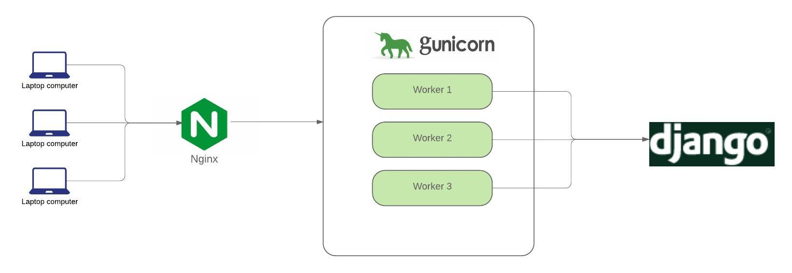

# What's in this repo?
This repository contains Python code and configuration files for Docker and Nginx.

The website is a simple "Hello World" Django website.

It is a demonstration of how I dockerized a Django application and using Nginx and Gunicorn 
to mimic production environment.

# Architecture

# How to build the container?

Clone this repository.

Create .env file and put your secret code in it and remove it from Django `settings.py`.

Make sure you are in the same directory as `docker-compose.yml`. 

Build the image and run the container:
`docker-compose up -d --build`

-d flag: run in detached mode, run the containers in the background, print new containers name

Once the app is up and running, visit http://localhost:1337 to see Hello World!